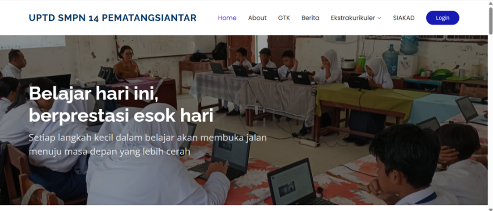
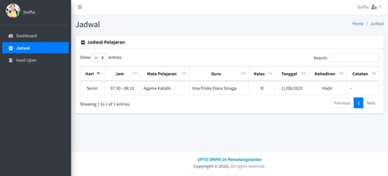

# School Web Portal & SIAKAD (Sistem Informasi Akademik)


## About The Project

Proyek ini adalah **Sistem Informasi Sekolah** yang menggabungkan Portal Informasi Publik (Front-end) dan Sistem Informasi Akademik/SIAKAD (Back-end). 

Aplikasi ini dikembangkan sebagai proyek akhir selama masa magang saya di **UPTD SMPN 14 Pematangsiantar**. Tujuan utamanya adalah untuk memfasilitasi transformasi digital sekolah, mengubah pengelolaan data nilai dan informasi yang sebelumnya manual menjadi terkomputerisasi dan berbasis web.

### Key Features

**1. Public Portal (Front-End):**
* **Profil Sekolah:** Menampilkan visi, misi, dan sejarah sekolah.
* **Berita & Pengumuman:** Informasi terkini kegiatan sekolah untuk publik/wali murid.
* **Galeri Foto:** Dokumentasi kegiatan siswa dan guru.
* **Informasi GTK:** Data Guru dan Tenaga Kependidikan.
* **Kontak & Lokasi:** Informasi alamat dan peta sekolah.

**2. Administrator & SIAKAD (Back-End):**
* **Dashboard Admin:** Ringkasan statistik data sekolah.
* **Manajemen Data Siswa:** CRUD (Create, Read, Update, Delete) data siswa.
* **Manajemen Data Guru:** Pengelolaan data pengajar.
* **Input Nilai (SIAKAD):** Digitalisasi rekapitulasi nilai siswa.
* **Manajemen Akun:** Pengaturan akses pengguna.

## Tech Stack

* **Language:** PHP (Native/Procedural)
* **Database:** MySQL
* **Frontend Framework:** Bootstrap 5 (Responsive Design)
* **Styling:** CSS3, FontAwesome
* **Server Environment:** XAMPP (Apache)

## Screenshots

| Halaman Beranda | Dashboard Siakad Siswa |
|:---:|:---:|
|  |  |

## Installation (Localhost)

1.  **Clone Repositori**
    ```bash
    git clone [https://github.com/ivanaanaomi/project-website-sekolah.git](https://github.com/ivanaanaomi/project-website-sekolah.git)
    ```
2.  **Setup Database**
    * Buka `phpMyAdmin`.
    * Buat database baru dengan nama `db_sekolah` (atau sesuaikan).
    * Import file `database.sql`.
3.  **Konfigurasi Koneksi**
    * Buka file `koneksi.php` (atau `config.php`).
    * Sesuaikan konfigurasi database:
        ```php
        $host = "localhost";
        $user = "root";
        $pass = "";
        $db   = "db_sekolah";
        ```
4.  **Jalankan**
    * Pindahkan folder project ke `htdocs` (jika menggunakan XAMPP).
    * Buka browser dan akses `http://localhost/nama-folder`.

## Author

* **Ivana Naomi Simanjuntak**
* [LinkedIn](https://linkedin.com/in/ivanaanaomi)

---
*Dikembangkan untuk keperluan edukasi dan arsip portofolio magang.*
